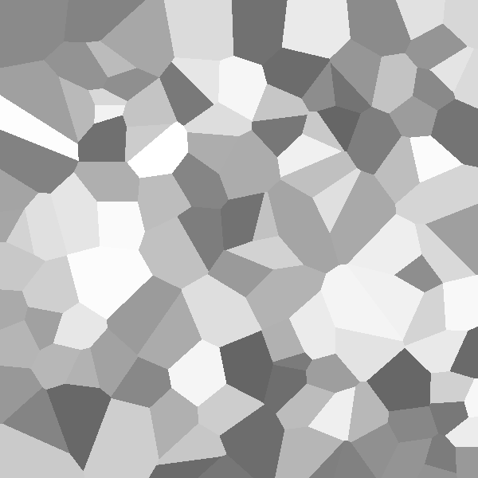
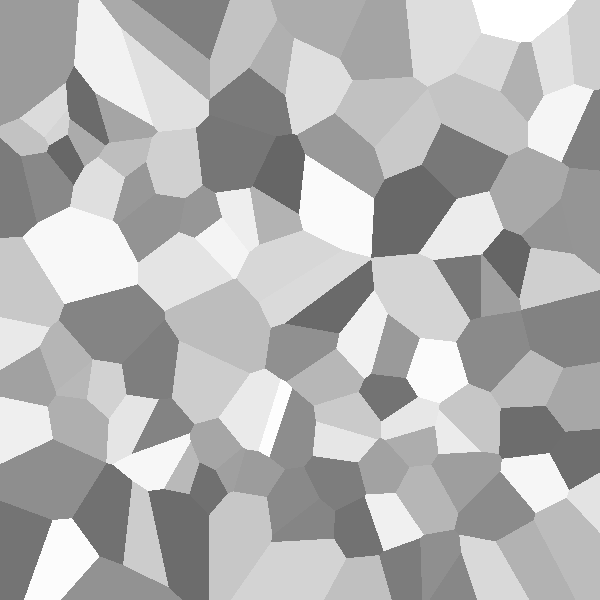
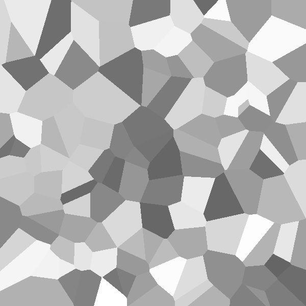

## Usage

```powershell
py .\main.py -h
```

```powershell
usage: main.py [-h] [-w WIDTH] [-c CELL_SIZE] [-o ORIENTATIONS] [-m {pseudo,sobol,halton,latin}]
               [--simulate | --no-simulate]

Generate microstructures and simulate their grain growth.

optional arguments:
  -h, --help            show this help message and exit
  -w WIDTH              Window size. (default: 500)
  -c CELL_SIZE          Cell size. Lower = more anti-aliased. (default: 5, recommended: 1-10)
  -o ORIENTATIONS       Inital grain size. Higher = Smaller grains. (default: 100)
  -m {pseudo,sobol,halton,latin}
                        Seed generation algorithm. (default: sobol)
  --simulate, --no-simulate
                        Simulate grain growth? (default: False)
```

## Resulting Grain Structures

|            Pseudo             |            Sobol            |
| :---------------------------: | :-------------------------: |
|  |  |

|            Halton             |            Latin Hypercube            |
| :---------------------------: | :-----------------------------------: |
|  |  |

## References

1. Paulo Blikstein, André Paulo Tschiptschin, Monte Carlo Simulation of Grain Growth.
2. S. Sista And T. Debroy, Three-Dimensional Monte Carlo Simulation of Grain Growth in Zone-Refined Iron.
3. N. Maazi, Conversion of Monte Carlo Steps to Real Time for Grain Growth Simulation.
